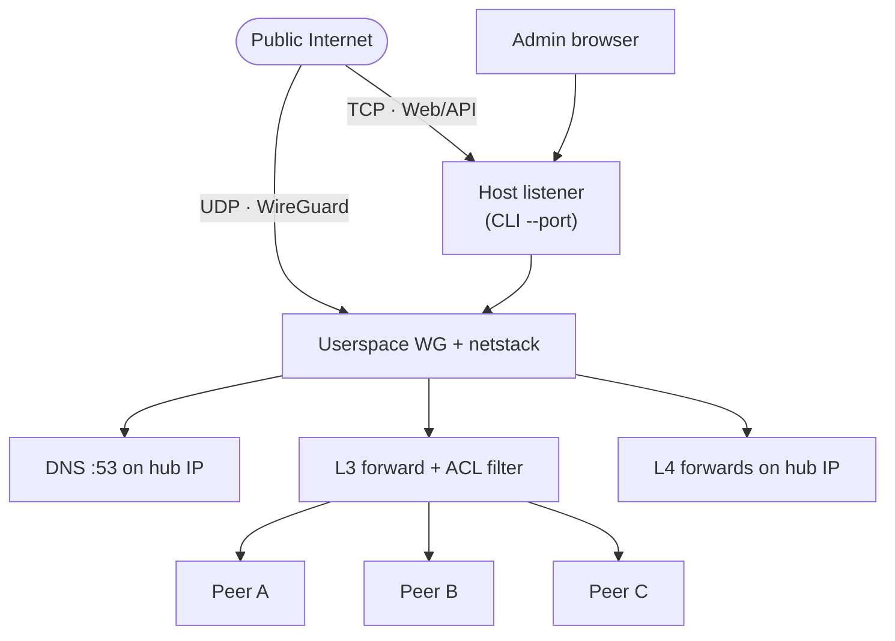

<h1 align="center">WireHub</h1>

<p align="center">
  <strong>Centralized hub and spoke WireGuard with a built in web UI. Server runs <a href="https://github.com/WireGuard/wireguard-go">userspace WireGuard</a> on gVisor netstack; one public endpoint, no kernel module.</strong>
</p>

<p align="center">
  <a href="docs/README_zh.md">中文说明</a>
</p>

<p align="center">
  <a href="https://go.dev/"></a>
  <a href="https://react.dev/"></a>
  <a href="https://www.docker.com/"></a>
  <a href="LICENSE"></a>
</p>

<p align="center">
  
</p>

## Features

- **Hub and spoke topology** — only the hub needs a routable endpoint; peers connect outbound
- **Single binary** — React admin UI embedded via `go:embed`; SQLite persistence
- **Setup wizard** — new hub or import `wirehub.db`; Hub / Admin / Advanced sections
- **Peer lifecycle** — create from Groups or Peers; rename, move group, enable/disable, delete; export `.conf` or QR code
- **Built in DNS** — `hub.wirehub`, `{peer}.wirehub`; `www.*` aliases; upstream resolvers for other names
- **Group access control** — one group per peer; **bidirectional** or **unidirectional** links on the topology graph (default deny across groups)
- **Live status** — WebSocket push: handshake, RX/TX, traffic charts
- **Port forwarding** — TCP/UDP listeners on hub VPN IP → FQDN or IPv4
- **Settings and backup** — runtime options, password change, database export, password protected reset
- **Userspace WireGuard** — [wireguard-go](https://github.com/WireGuard/wireguard-go) + gVisor netstack; no host TUN on the hub

## Architecture



- **Control plane** — Gin REST API + React UI (JWT auth). Status is pushed over WebSocket.
- **Data plane** — WireGuard tunnels terminate in netstack. Peer-to-peer traffic is forwarded and filtered by group policy. Traffic to the hub itself (Web, DNS, forward listeners) is not subject to peer ACL rules.

## Quick start

### Docker

```bash
docker pull ghcr.io/touken928/wirehub:latest

docker run -d --name wirehub \
  --restart unless-stopped \
  -p 8443:8443 \
  -p 8443:8443/udp \
  -v wirehub-data:/app/data \
  ghcr.io/touken928/wirehub:latest
```

Or build locally: `docker compose -f docker/compose.yml up -d --build`.

No `--cap-add` or `--privileged` is required. Image defaults: data dir `/app/data`, port `8443`, bind `0.0.0.0`.

Open **http://localhost:8443/setup** for first-run configuration.

### Release binary

Download from [GitHub Releases](https://github.com/touken928/wirehub/releases) (`wirehub-vX.Y.Z-<platform>`). Targets: Linux amd64/arm64, macOS arm64, Windows amd64.

```bash
chmod +x wirehub-vX.Y.Z-linux-amd64
./wirehub-vX.Y.Z-linux-amd64 --data-dir ./data
```

### From source

Requires Go 1.26+ and Node.js 22+.

```bash
cd web && npm ci && npm run build && cd ..
go build -o wirehub ./cmd/wirehub
./wirehub --data-dir ./data
```

Frontend output: `internal/static/dist` (embedded via `go:embed`).

## Initial setup

On a fresh install the HTTP server starts immediately; WireGuard and DNS start only after setup completes.

1. Open **http://&lt;host&gt;:&lt;port&gt;/setup**
2. **Import** an existing `wirehub.db`, or complete the **new hub** form (Hub / Admin / Advanced)
3. Sign in with the admin account

| Field | Default | Notes |
|-------|---------|-------|
| Public endpoint | — | Hostname or IP in client `Endpoint` (before `:`) |
| Client endpoint port | `8443` | Port in client `Endpoint`; may differ from CLI `--port` under NAT |
| VPN subnet | `100.127.0.0/24` | Hub and DNS use the first host (`.1`) |
| Admin username | `admin` | Fixed after setup |
| Admin password | — | Required; min 8 characters |
| MTU | `1420` | Editable later; change restarts VPN stack |
| Status interval | `1` s | Peer stats poll interval |
| Upstream DNS | — (optional) | Hub resolvers for non-`wirehub` queries; empty = `*.wirehub` only |

JWT secret: `{data-dir}/.jwt_secret` (created on first launch).

## Configuration

### CLI (process only)

| Flag | Default | Purpose |
|------|---------|---------|
| `--port` | `8443` | Host TCP (Web/API) and UDP (WireGuard) bind port |
| `--bind` | `0.0.0.0` | Host HTTP bind address |
| `--data-dir` | `./data` | SQLite DB and secrets |

`settings.listen_port` in the database is written to peer configs only; it does not change the hub bind port.

### Database (after setup)

| Setting | Editable in UI | Notes |
|---------|----------------|-------|
| Public endpoint, subnet, admin username, client endpoint port | No | Set at setup or via DB import |
| MTU, status interval, upstream DNS | Yes | **Settings** |
| Admin password | Yes | **Settings** |
| Export / reset | — | Full `wirehub.db` export; reset wipes data (password required) |

## Admin UI

| Page | Purpose |
|------|---------|
| **Dashboard** | Hub summary, endpoint, live peer stats and traffic chart |
| **Groups** | Topology graph; link mode (bidirectional / unidirectional); per-group peer cards; rename peers, change group |
| **Peers** | All peers with search and filters; create, rename, move group, config download, enable/disable, delete |
| **Forward** | TCP/UDP listeners on hub VPN IP → target host:port |
| **Settings** | Runtime options, password, export, reset |

Destructive actions require confirmation; hub reset also requires the admin password.

## Client onboarding

1. Create a peer under **Groups** (group panel) or **Peers** (dialog with group picker)
2. Download `.conf` or scan the QR code
3. Import into a WireGuard client and connect

Generated configs include keys, `Endpoint`, `AllowedIPs` (full subnet), `DNS` (hub VPN IP only), and MTU. The config comment points to `http://hub.wirehub/` for the admin UI over the tunnel (port 80 on the hub VPN address; the host bind port defaults to `8443`).

## Networking

### DNS

Resolver on hub VPN IP (UDP 53). Suffix is fixed: `wirehub`; hub label is `hub`.

| Name | Answer |
|------|--------|
| `hub.wirehub`, `www.hub.wirehub` | Hub VPN IP |
| `{peer}.wirehub`, `www.{peer}.wirehub` | Peer VPN IP |

Bare `wirehub` / `www.wirehub` are not served. When upstream DNS is configured, other names are forwarded server-side (not listed in peer configs). With no upstream, external names are not resolved. Other VPN or proxy tools (e.g. Clash TUN) may hijack DNS and prevent `*.wirehub` from resolving.

### Access control

- Each peer belongs to **one group**. Peers in the same group may reach each other directly.
- **Cross-group** access requires an explicit link on the **Groups** graph (default deny).
  - **Bidirectional** — both groups may initiate to each other over WireGuard.
  - **Unidirectional** (`A → B`) — peers in `A` dial `B`’s IP and port as usual; the hub SNATs outbound traffic so `B` sees the hub. Return traffic is rewritten for `A`. `B` cannot initiate to `A`.

Policy applies to peer-to-peer traffic only, not to reaching the hub Web UI or DNS.

### Port forwarding

Rules listen on the **hub VPN IP** and proxy to a target. Peers connect to `{hub_ip}:{listen_port}` inside the tunnel.

| Target | Resolution |
|--------|------------|
| `*.wirehub` FQDN | Hub authoritative DNS |
| External hostname | Upstream DNS (A record) |
| IPv4 | Literal address |

Target must be a FQDN or IPv4 (not a bare peer name). Toggle **Enabled** to apply without restarting the VPN stack. This is explicit L4 proxying, separate from unidirectional group SNAT.

## Development

```bash
# Backend + embedded UI
cd web && npm ci && npm run build && cd ..
go run ./cmd/wirehub --data-dir ./data

# Frontend dev (proxy /api → :8080)
go run ./cmd/wirehub --port 8080 --data-dir ./data   # terminal 1
cd web && npm run dev                               # terminal 2

go test ./...
```

## License

[GNU General Public License v3.0](LICENSE)
