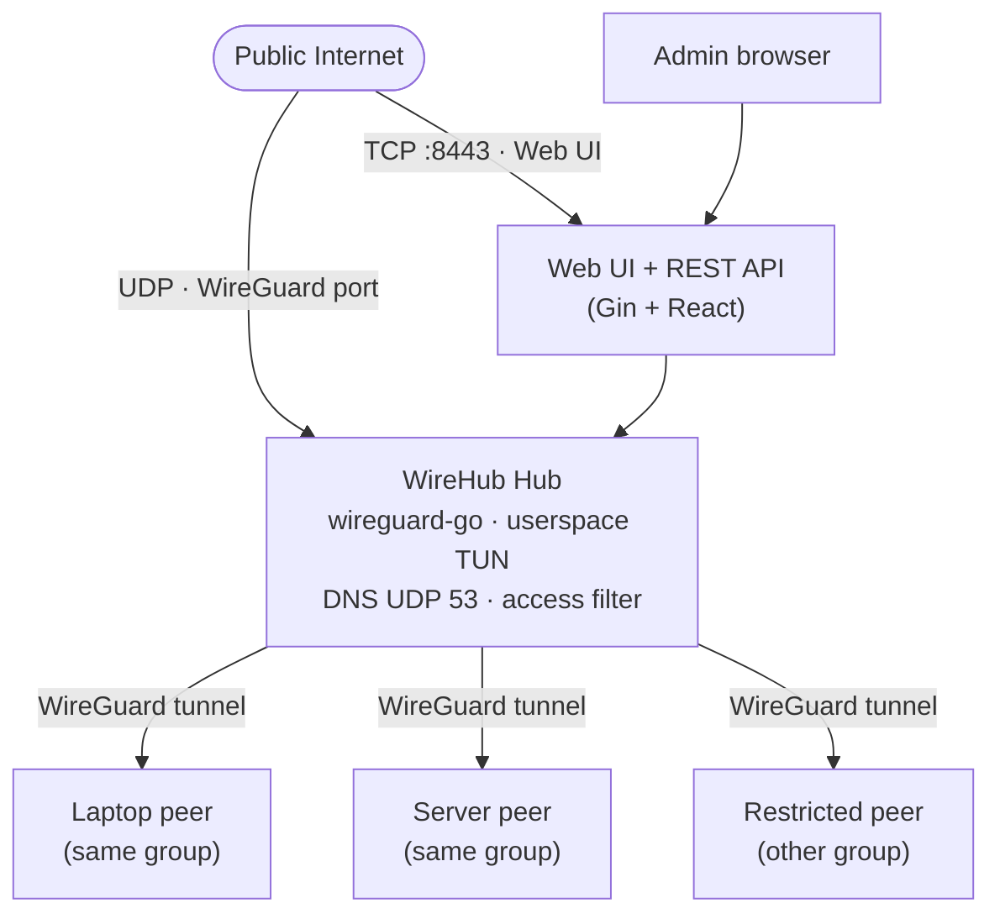

<h1 align="center">WireHub</h1>

<p align="center">
  <strong>Centralized hub-and-spoke WireGuard management with a built-in web dashboard — one public hub endpoint, <a href="https://github.com/WireGuard/wireguard-go">userspace WireGuard</a> on the server, no kernel module required.</strong>
</p>

<p align="center">
  <a href="docs/README_zh.md">中文说明</a>
</p>

<p align="center">
  <a href="https://go.dev/"></a>
  <a href="https://react.dev/"></a>
  <a href="https://www.docker.com/"></a>
  <a href="LICENSE"></a>
</p>

<p align="center">
  
</p>

## Features

- **Hub-and-spoke topology** — only the hub needs a routable endpoint; peers connect outbound
- **Web admin UI** — React + Fluent UI; embedded in the release binary
- **Peer lifecycle** — create, edit, disable, delete; export `.conf` or scan a QR code
- **Built-in DNS** — `{name}.wirehub`; `www.{name}.wirehub` is an alias (`www` → hub)
- **Group-based access control** — peers belong to one group; cross-group access is admin-controlled (default deny)
- **Live status** — last handshake, RX/TX bytes, network usage charts
- **Port forwarding** — expose TCP/UDP ports on the hub VPN IP and proxy to a peer, hostname, or external target
- **Settings & backup** — edit runtime hub options, export/import full `wirehub.db`, password-protected reset
- **Userspace WireGuard** — [wireguard-go](https://github.com/WireGuard/wireguard-go) + gVisor netstack; no kernel module on the hub

## How it works



After setup, the hub serves tunnel web UI and DNS on the VPN address. Peer-to-peer traffic is L3-forwarded and filtered by group rules; traffic to the hub itself is not filtered.

## Web UI

| Page | Purpose |
|------|---------|
| **Dashboard** | Hub status, WireGuard endpoint, live traffic chart |
| **Groups** | React Flow graph — drag links between groups for cross-group access; click a group to manage members |
| **Users** | All peers with online status, config download, enable/disable, delete |
| **Forward** | TCP/UDP port forwards on the hub VPN IP → peer, `*.wirehub`, or external host |
| **Settings** | Editable hub options, password change, database export, danger-zone reset |

Destructive actions (delete user/group, disconnect link, reset hub) require confirmation in the UI. Reset also requires your admin password.

## Requirements

| Component | Version |
|-----------|---------|
| Go (from source) | 1.26+ |
| Node.js (frontend build) | 22+ |
| Docker (optional) | 20+ |

## Quick start

### Docker (recommended)

Pull a release image from GitHub Container Registry:

```bash
docker pull ghcr.io/touken928/wirehub:latest

docker run -d --name wirehub \
  -p 8443:8443 \
  -p 8443:8443/udp \
  -v wirehub-data:/app/data \
  ghcr.io/touken928/wirehub:latest
```

Build locally with Compose:

```bash
docker compose -f docker/docker-compose.yml up -d --build
```

Open **http://localhost:8443/setup** and complete the first-run wizard.

No `--cap-add` or `--privileged` is required: WireHub uses wireguard-go's userspace netstack (gVisor), not a kernel TUN device. CLI flags (`--data-dir`, `--port`, `--bind`) are optional in the image — defaults are `./data` (i.e. `/app/data` with `WORKDIR /app`), `8443`, and `0.0.0.0`.

### Pre-built binary

Download the executable for your platform from [GitHub Releases](https://github.com/touken928/wirehub/releases) (uncompressed assets), then:

```bash
chmod +x wirehub-vX.Y.Z-linux-amd64
./wirehub-vX.Y.Z-linux-amd64 --data-dir ./data
```

```powershell
.\wirehub-vX.Y.Z-windows-amd64.exe --data-dir .\data
```

Supported release targets: **Linux amd64**, **Linux arm64**, **macOS arm64**, **Windows amd64**.

### From source

```bash
cd web && npm ci && npm run build && cd ..
go build -o wirehub ./cmd/wirehub
./wirehub --data-dir ./data
```

The frontend build output is written to `internal/static/dist` and embedded via `go:embed` in `internal/static/static.go`.

## First-run setup

On a fresh install the HTTP server starts immediately, but WireGuard and DNS start only after setup.

1. Open **http://&lt;host&gt;:8443/setup** (or your `--port`)
2. Optionally **Import wirehub.db** to restore a backup, **or** fill in the new-hub form
3. Sign in with the admin account you created

### New hub wizard

| Field | Required | Notes |
|-------|----------|-------|
| Public endpoint | Yes | Hostname or IP in client `Endpoint` (before the port), e.g. `example.com` |
| Client endpoint port | Yes | Port in peer `Endpoint` (`host:port`); default **8443** |
| VPN subnet | No | Default `100.127.0.0/24`; hub and DNS use the first host (`.1`) |
| Admin username | No | Default `admin` |
| Admin password | Yes | At least 8 characters; bcrypt hash in SQLite |
| MTU | No | Default `1420` |
| Status interval | No | Default `1` second between peer status polls |
| Additional DNS | No | Default `1.2.4.8`, `1.1.1.1` — upstream resolvers in client configs |

### Import

Upload a previously exported **wirehub.db** to restore groups, users, and hub settings, then sign in with the existing admin account.

The JWT signing secret is created automatically on first launch and stored at `{data-dir}/.jwt_secret`.

## Settings (after setup)

Open **Settings** in the sidebar.

| Section | Editable |
|---------|----------|
| Hub (read-only) | Public endpoint, VPN subnet, admin username |
| Editable | Client endpoint port, MTU, status interval, additional DNS |
| Change password | Current + new password |
| Export | Download full `wirehub.db` snapshot |
| Danger zone | **Reset WireHub** — wipes all data; requires admin password |

Changing **MTU** restarts the VPN stack. **Reset** returns to setup mode.

Fields fixed after setup: public endpoint, VPN subnet, admin username (set only in the wizard or via database import).

## Port forwarding

Open **Forward** in the sidebar. Each rule listens on the **hub VPN IP** (`hub_ip` from settings) and proxies to a target host and port. Peers reach the service at `{hub_ip}:{listen_port}` over the tunnel.

| Target | Example | Resolution |
|--------|---------|------------|
| Peer | `alice` or `alice.wirehub` | Hub authoritative DNS |
| External hostname | `db.example.com` | Additional DNS from **Settings** (A record) |
| IPv4 address | `10.0.0.5` | Used as-is (IPv4 only) |

A single label without a dot (e.g. `app`) is treated as a peer name (`app.wirehub`), not a public hostname. Listen ports `53` and the hub `--port` are reserved. Toggle **Enabled** in the list; changes apply without restarting the VPN stack.

REST: `GET/POST /api/forwards`, `PUT/DELETE /api/forwards/:id`.

## CLI flags

Process-level settings only — not stored in the database:

| Flag | Default | Description |
|------|---------|-------------|
| `--port` | `8443` | Hub listen port (Web/API TCP and WireGuard UDP). `listen_port` in the DB is only the port written to peer configs (`Endpoint`), e.g. when using port forwarding |
| `--bind` | `0.0.0.0` | Address for the HTTP server |
| `--data-dir` | `./data` | SQLite database, JWT secret, persistent state |

```bash
./wirehub --port 8443 --bind 0.0.0.0 --data-dir ./data
```

## Client setup

1. Sign in to the web UI
2. Under **Groups**, select a group and add a user — or use **Users** to manage peers
3. Download the `.conf` file or scan the QR code
4. Import into any WireGuard client and connect

Each client config includes `Endpoint`, keys, allowed IPs, DNS (`hub IP` plus additional resolvers), and MTU.

## DNS

WireHub runs a resolver on the hub VPN IP (UDP 53). Names under `wirehub` are answered authoritatively; other queries are forwarded to the **additional DNS** servers configured at setup (default `1.2.4.8`, `1.1.1.1`).

Client WireGuard configs list DNS as `{hub_ip}, {upstream…}` so peers resolve internal hostnames via the hub and can reach the public internet through upstream resolvers.

| Name | Resolves to |
|------|-------------|
| `wirehub` | Hub VPN IP |
| `www.wirehub` | Hub VPN IP (alias) |
| `{peer}.wirehub` | Peer VPN IP |
| `www.{peer}.wirehub` | Peer VPN IP (alias) |

The suffix `wirehub` is fixed (`internal/config/config.go`).

## Access control

Peers are assigned to **groups** (one group per user). Users in the same group can reach each other. **Cross-group access** is controlled in **Groups** (React Flow): connect groups with an edge to allow traffic; groups without a link cannot reach each other (**default deny**).

Rules are enforced in the hub's userspace forwarding path. They apply to **peer ↔ peer** traffic, not to reaching the hub web UI or DNS.

## Development

**Backend + embedded UI** (production-like):

```bash
cd web && npm ci && npm run build && cd ..
go run ./cmd/wirehub --data-dir ./data
```

**Frontend dev server** with API proxy (run the Go server on port `8080`):

```bash
# terminal 1
go run ./cmd/wirehub --port 8080 --data-dir ./data

# terminal 2
cd web && npm ci && npm run dev
```

Vite proxies `/api` to `http://localhost:8080` (see `web/vite.config.ts`).

**Tests:**

```bash
go test ./...
```

## License

[GNU General Public License v3.0](LICENSE)
