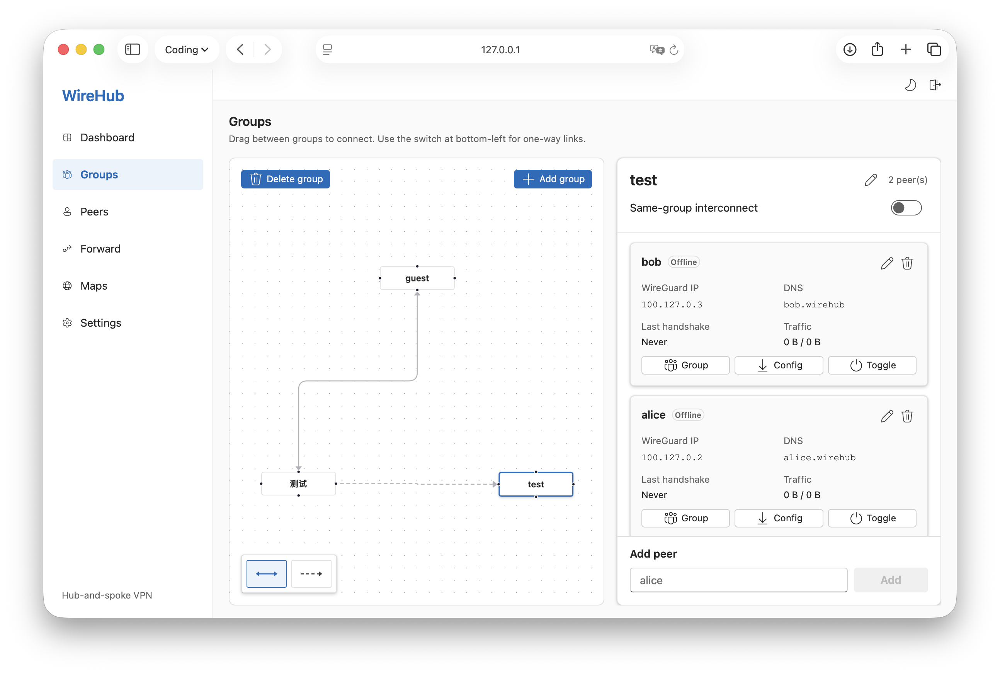
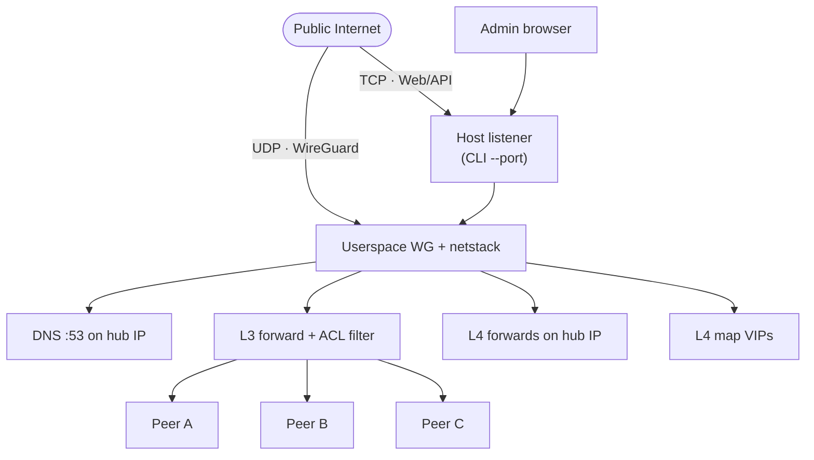

<h1 align="center">WireHub</h1>

<p align="center">
  <strong>Centralized hub-and-spoke WireGuard with a built-in web UI. Server runs <a href="https://github.com/WireGuard/wireguard-go">userspace WireGuard</a> on gVisor netstack; one public endpoint, no kernel module.</strong>
</p>

<p align="center">
  <a href="docs/README_zh.md">中文说明</a>
</p>

<p align="center">
  <a href="https://go.dev/"></a>
  <a href="https://react.dev/"></a>
  <a href="https://www.docker.com/"></a>
  <a href="LICENSE"></a>
</p>

<p align="center">
  
</p>

## Features

- Hub-and-spoke WireGuard (userspace, single binary, embedded React UI, SQLite)
- Built-in `*.wirehub` DNS, group ACL, port **Forward**, and **Maps** (virtual IP + DNS)
- Live peer status over WebSocket; admin on host port (default `8443`) and on `http://hub.wirehub/` inside the tunnel

## Architecture



**Control plane** — REST API + React UI (JWT). **Data plane** — WireGuard in netstack; peer-to-peer traffic is ACL-filtered. Traffic to the hub (Web, DNS, forwards) and to map VIPs is handled on the hub; map group access is enforced in the proxy.

## Quick start

### Deployment

**Docker**

```bash
docker pull ghcr.io/touken928/wirehub:latest

docker run -d --name wirehub \
  --restart unless-stopped \
  -p 8443:8443 \
  -p 8443:8443/udp \
  -v wirehub-data:/app/data \
  ghcr.io/touken928/wirehub:latest
```

Or: `docker compose -f docker/compose.yml up -d --build`. No `--cap-add` / `--privileged`.

**Release binary** — [GitHub Releases](https://github.com/touken928/wirehub/releases) (Linux amd64/arm64, macOS arm64, Windows amd64).

```bash
chmod +x wirehub-vX.Y.Z-linux-amd64
./wirehub-vX.Y.Z-linux-amd64 --data-dir ./data
```

**From source** — Go 1.26+, Node.js 22+.

```bash
cd web && npm ci && npm run build && cd ..
go build -o wirehub ./cmd/wirehub
./wirehub --data-dir ./data
```

### Startup parameters

| CLI flag | Default | Purpose |
|----------|---------|---------|
| `--port` | `8443` | Host TCP (Web/API) and UDP (WireGuard) |
| `--bind` | `0.0.0.0` | HTTP bind address |
| `--data-dir` | `./data` | SQLite (`wirehub.db`) and secrets (`.jwt_secret`) |
| `--allow-remote-setup` | `false` | Allow first-run setup/import from non-localhost clients |

`settings.listen_port` in the database is written into peer configs only; it does **not** change the hub bind port. MTU, status interval, upstream DNS, and the admin password are editable later under **Settings**.

### Initial setup

HTTP starts immediately; WireGuard and DNS start after setup completes.

For security, when the hub is still unconfigured, `/setup`, `/api/setup/status`, and `/api/setup/import` accept requests from `localhost` only by default. This prevents a public fresh deployment from being claimed by the first remote client. Use `--allow-remote-setup` only when you intentionally need remote first-run setup.

1. Open **http://&lt;host&gt;:&lt;port&gt;/setup** — import an existing `wirehub.db` or create a new hub
2. Sign in with the admin account

| Field | Default | Notes |
|-------|---------|-------|
| Public endpoint | — | Host in client `Endpoint` (before `:`) |
| Client endpoint port | `8443` | Port in client `Endpoint`; may differ from CLI `--port` |
| VPN subnet | `100.127.0.0/24` | Hub uses first host (`.1`) |
| Upstream DNS | — | Optional; non-`wirehub` names forwarded server-side |

## Admin UI

Sign in after setup. Destructive actions ask for confirmation; hub reset requires the admin password.

### Dashboard

Hub public endpoint and `hub.wirehub` DNS name, peer online/offline counts, aggregate traffic chart, and recently active peers. Use it for a quick health check before drilling into **Groups** or **Peers**.

### Groups

Interactive topology graph for group ACL.

- Create, rename, or delete groups; open a group to manage its peers (rename, move group, download config, enable/disable, delete).
- **Same-group interconnect** (per group): when on, peers in the same group reach each other directly; when off, peer-to-peer traffic within the group is blocked (hub Web, DNS, forwards, and maps still work).
- Draw **bidirectional** links so both groups may initiate to each other.
- Draw **unidirectional** links (`A → B`): group A may reach group B; the hub SNATs return traffic so group B cannot initiate back.

Cross-group traffic is denied by default until a link exists on the graph.

### Peers

Full peer list with **search** and filters (group, online/offline/disabled). Add peers here or from a group panel; row actions match **Groups**.

Each peer gets a VPN IP and authoritative DNS: `{name}.wirehub` and `www.{name}.wirehub` resolve to its WireGuard address. Peer configs include keys, `Endpoint`, full-subnet `AllowedIPs`, `DNS` (hub VPN IP only), and MTU.

### Forward

**Search** port-forward rules. Add, edit, or delete TCP/UDP listeners on the **hub VPN IP** that relay to a fixed target `host:port`.

- Peers dial `{hub_ip}:{listen_port}` or `hub.wirehub:{listen_port}`.
- Target host may be a `*.wirehub` FQDN (hub DNS), an external hostname (upstream DNS when configured), or an IPv4 address.
- Any connected peer may use forwards (hub-originated traffic). Rules apply immediately when saved.

Example: hub listens on `:3389` → `192.168.9.112:3389` for RDP through the tunnel.

### Maps

**Search** service maps. Add, edit, or delete `{slug}.wirehub` entries that resolve to a dedicated **virtual IP** in the VPN subnet and relay TCP/UDP to a target host on the **same port** (no port remapping).

- Peers dial `{slug}.wirehub:{service_port}` or the map virtual IP.
- DNS returns the virtual IP only when the peer’s group is in the map’s allow list; otherwise NXDOMAIN.
- Only allowed groups may connect; access is enforced in the map proxy.

Example: `4080s.wirehub:3389` → `192.168.9.112:3389` when the backend listens on 3389.

| | **Forward** | **Maps** |
|---|-------------|----------|
| Dial | `hub.wirehub` or hub VPN IP + **listen port** | `{slug}.wirehub` or map **virtual IP** + **service port** |
| Target port | Set in the rule | **Same as client port** |
| Access | Any peer | Allowed groups only |

Built-in DNS also serves `hub.wirehub` / `www.hub.wirehub` (hub VPN IP). Bare `wirehub` is not served. Without upstream DNS, only `*.wirehub` names resolve.

### Settings

MTU, status poll interval, upstream DNS resolvers, admin password change, database export, and password-protected hub reset.

## Client onboarding

1. Create a peer on **Groups** or **Peers**
2. Download the `.conf` file or scan the QR code
3. Import into an official WireGuard client and connect

**Official WireGuard downloads**

| Platform | Link |
|----------|------|
| All platforms | [wireguard.com/install](https://www.wireguard.com/install/) |
| Windows | [Download installer](https://download.wireguard.com/windows-client/wireguard-installer.exe) |
| macOS | [Mac App Store](https://apps.apple.com/app/wireguard/id1451685025) |
| iOS | [App Store](https://apps.apple.com/app/wireguard/id1441195209) |
| Android | [Google Play](https://play.google.com/store/apps/details?id=com.wireguard.android) |

After connecting, open **http://hub.wirehub/** for the admin UI over the tunnel (HTTP on the hub VPN address, port 80).

## Development

```bash
cd web && npm ci && npm run build && cd ..
go run ./cmd/wirehub --data-dir ./data

# Frontend dev: API proxied to :8080
go run ./cmd/wirehub --port 8080 --data-dir ./data   # terminal 1
cd web && npm run dev                               # terminal 2

go test ./...
```

## License

[GNU General Public License v3.0](LICENSE)
