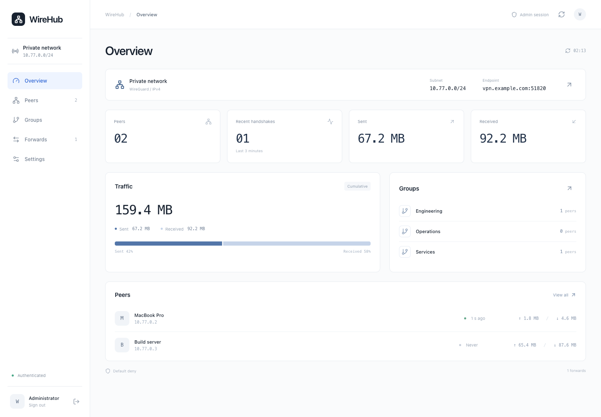

<h1 align="center">WireHub</h1>

<p align="center">
  Connect your devices and manage your WireGuard network, group access, and service forwarding in your browser.
</p>

<p align="center">
  <a href="https://github.com/touken928/WireHub/actions/workflows/integration.yml"></a>
  <a href="https://github.com/touken928/WireHub/pkgs/container/wirehub"></a>
  <a href="LICENSE"></a>
</p>

<p align="center">
  
</p>

## Features

- View peer activity and traffic.
- Add peers and download their WireGuard configurations.
- Connect groups by dragging to set one-way, two-way, and same-group access.
- Share peer services with selected groups through a single hub address.

## Quick start

WireHub supports native builds on Unix systems only. Windows is unsupported and is not built or tested.

### Docker

Replace the admin token with your own long random secret, then start WireHub:

```sh
export WIREHUB_ADMIN_TOKEN='replace-with-a-long-random-secret'

docker run -d --name wirehub \
  --restart unless-stopped \
  -e WIREHUB_ADMIN_TOKEN \
  -e WIREHUB_TRUSTED_PROXY_MODE=1 \
  -p 127.0.0.1:51820:51820/tcp \
  -p 51820:51820/udp \
  -v wirehub-data:/data \
  ghcr.io/touken928/wirehub:latest
```

### Linux binary

Download the file for your platform from [GitHub Releases](https://github.com/touken928/WireHub/releases):

| Platform | File |
| --- | --- |
| Linux amd64 | `wirehub-vX.Y.Z-linux-amd64` |
| Linux arm64 | `wirehub-vX.Y.Z-linux-arm64` |

```sh
chmod +x wirehub-vX.Y.Z-linux-amd64
export WIREHUB_ADMIN_TOKEN='replace-with-a-long-random-secret'
./wirehub-vX.Y.Z-linux-amd64
```

Use the `linux-arm64` file on ARM servers.

The web UI is included. Run the binary from a dedicated folder and keep that folder's data when updating.

Open **[http://localhost:51820](http://localhost:51820)**, enter the same admin token, and click **Connect**.

For a remote server, run `ssh -L 51820:127.0.0.1:51820 user@server`, then open the address above in your local browser. The admin interface is available only on the server's loopback interface by default. Use an HTTPS reverse proxy for public access.

### Build from source on Unix

Install Rust, Node.js 22, pnpm 9.15.9, and a native C toolchain for the bundled SQLite dependency. Build on the Unix system where you intend to run WireHub:

```sh
pnpm --dir frontend install --frozen-lockfile
pnpm --dir frontend build
cargo build --release --locked
export WIREHUB_ADMIN_TOKEN='replace-with-a-long-random-secret'
./target/release/wirehub
```

The frontend must be built first so its assets are embedded in the binary. Release binaries are built natively on Linux amd64 and arm64 runners.

### Initial setup

| Field | Value |
| --- | --- |
| **Subnet** | Defaults to `10.10.10.0/24`. Choose a range that does not overlap your existing networks. |
| **Endpoint** | Your server's public IP or domain with a port, such as `vpn.example.com:51820`. |
| **Keepalive** | Defaults to `25` seconds. |

Click **Create network** to finish setup. The subnet cannot be changed afterward. With the default subnet, the hub uses `10.10.10.1` and peers start at `10.10.10.2`. Allow UDP port `51820` on your server.

## Usage

### Add a peer

1. Open **Groups** and click **New group**.
2. Open **Peers**, click **New peer**, enter a name, and select a group.
3. Download the generated `.conf`, import it into a [WireGuard client](https://www.wireguard.com/install/), and connect.

Save the configuration when you create the peer; it is only provided once. If you lose it, delete and recreate the peer.

### Set access permissions

In **Groups**, drag from a connection handle on one group to another:

- **One way**: allow the source group to access the target group.
- **Both ways**: allow both groups to access each other.
- **Intra-group access**: enable this in the group details to allow peers in the same group to access each other.

Click **Save** to apply changes. Select a connection and press **Delete** to remove access. Access between peers is denied until explicitly allowed.

### Forward a service

In **Forwards**, click **New forward** and choose the target peer, TCP/UDP, service port, and allowed groups. Each source group also needs access to the target group in **Groups**.

For example, forward a peer's TCP `8080` service so authorized peers can reach it at **`10.10.10.1:8080`**.

### Settings and updates

Change Endpoint and Keepalive in **Settings**. Changes apply to configurations generated afterward.

To update, pull the image, stop and remove the old container, then repeat the startup command with the same `wirehub-data` volume. Keep and back up this volume to preserve your network configuration.

### Runtime health and capacity

`/api/health` is a liveness check: it reports that the HTTP service is responding. `/api/ready` reports whether the UDP router has loaded and activated a valid runtime snapshot; it returns **503 Service Unavailable** while the router is unavailable or a reload/recovery has failed. A successful initial load—including an empty, not-yet-configured network—becomes ready. An invalid initial snapshot fails startup rather than starting a degraded router.

After a runtime reload fails, WireHub fails closed, reports the reload failure, and retries loading a complete snapshot with exponential backoff (1, 2, 4 seconds, up to 30 seconds). Readiness returns to healthy only after a complete valid snapshot is installed. UDP receive errors considered recoverable are logged by error category and do not take the router offline; fatal receive errors stop the router and mark it not ready. Logs and health responses do not include keys or packet contents.

Each peer is limited to **256 active plus pending flow entries**. Separately, the router's queued-delivery buffer is bounded to 256 packets and also enforces byte and time limits; excess queued work is dropped rather than growing without bound.

---

Each version tag publishes **Linux amd64 / arm64** binaries to GitHub Releases, along with **amd64 / arm64** Docker images. See [`v0`](https://github.com/touken928/WireHub/tree/v0) for the previous version.
# Database and hub-key backups

This release uses strict schema version 3. Older or structurally drifted databases are rejected; there is no automatic migration. At startup, WireHub binds the hub private-key file to the public identity persisted in SQLite; network setup does not create or bind that identity. Back up the SQLite database and hub private-key file together as an immutable identity pair. Restoring only one half can make startup fail because the persisted public identity must match the private key. Schema drift detection includes unexpected SQLite statistics tables and index objects.

## Hub-key security

Hub-key files are created exclusively with mode `0600`. Startup rejects symlinks, non-regular files, files with permissions other than `0600`, and keys that are not exactly 32 bytes. It checks the opened file's device and inode against the inspected path and validates permissions again before reading. Existing keys are never silently repaired or replaced.

Publication syncs an exclusive temporary file, creates a non-overwriting hard link, removes the temporary file, and syncs the parent directory. Store the key in a directory controlled by the account running WireHub on a filesystem that supports hard links and directory syncing. Back up `wirehub.sqlite3` and `wirehub.key` together, preserving mode `0600` when restoring the key.
