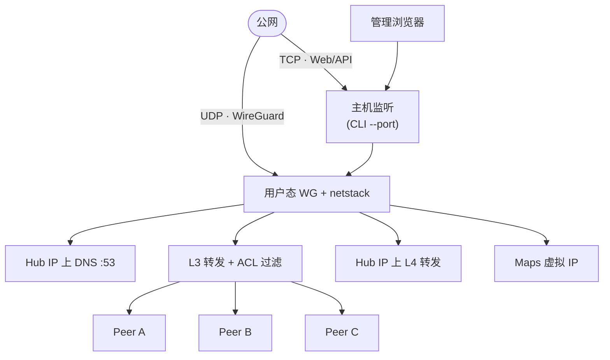

<h1 align="center">WireHub</h1>

<p align="center">
  <strong>集中式星型 WireGuard Hub，内嵌 Web 管理界面。服务端以 <a href="https://github.com/WireGuard/wireguard-go">用户态 WireGuard</a>（gVisor netstack）运行，单点公网 Endpoint，无需内核模块。</strong>
</p>

<p align="center">
  <a href="../README.md">English</a>
</p>

<p align="center">
  <a href="https://go.dev/"></a>
  <a href="https://react.dev/"></a>
  <a href="https://www.docker.com/"></a>
  <a href="../LICENSE"></a>
</p>

<p align="center">
  
</p>

## 功能

- 星型 WireGuard（用户态、单二进制、内嵌 React、SQLite）
- 内置 `*.wirehub` DNS、组 ACL、端口 **Forward** 与 **Maps**（虚拟 IP + DNS）
- WebSocket 推送 Peer 状态；管理面在主机端口（默认 `8443`）与隧道内 `http://hub.wirehub/`

## 架构



**控制面** — REST API + React（JWT）。**数据面** — WireGuard 终结于 netstack；Peer 间流量受 ACL 过滤。访问 Hub（Web、DNS、转发）与 Maps 虚拟 IP 由 Hub 处理；Maps 的组权限在代理层校验。

## 快速开始

### 部署

**Docker**

```bash
docker pull ghcr.io/touken928/wirehub:latest

docker run -d --name wirehub \
  --restart unless-stopped \
  -p 8443:8443 \
  -p 8443:8443/udp \
  -v wirehub-data:/app/data \
  ghcr.io/touken928/wirehub:latest
```

或：`docker compose -f docker/compose.yml up -d --build`。无需 `--cap-add` / `--privileged`。

**预编译二进制** — [GitHub Releases](https://github.com/touken928/wirehub/releases)（Linux amd64/arm64、macOS arm64、Windows amd64）。

```bash
chmod +x wirehub-vX.Y.Z-linux-amd64
./wirehub-vX.Y.Z-linux-amd64 --data-dir ./data
```

**源码构建** — Go 1.26+、Node.js 22+。

```bash
cd web && npm ci && npm run build && cd ..
go build -o wirehub ./cmd/wirehub
./wirehub --data-dir ./data
```

### 启动参数

| CLI 参数 | 默认 | 作用 |
|----------|------|------|
| `--port` | `8443` | 主机 TCP（Web/API）与 UDP（WireGuard） |
| `--bind` | `0.0.0.0` | HTTP 绑定地址 |
| `--data-dir` | `./data` | SQLite（`wirehub.db`）与密钥（`.jwt_secret`） |

库内 `listen_port` 仅写入 Peer 配置，**不**改变 Hub 绑定端口。MTU、状态间隔、上游 DNS、管理员密码可在 **Settings** 中修改。

### 首次配置

HTTP 立即启动；WireGuard 与 DNS 在配置完成后启动。

1. 打开 **http://&lt;主机&gt;:&lt;端口&gt;/setup** — 导入已有 `wirehub.db` 或新建 Hub
2. 使用管理员账号登录

| 字段 | 默认 | 说明 |
|------|------|------|
| Public endpoint | — | 客户端 `Endpoint` 中的主机（`:` 之前） |
| Client endpoint port | `8443` | 客户端 `Endpoint` 端口；可与 CLI `--port` 不同 |
| VPN subnet | `100.127.0.0/24` | Hub 使用首个主机地址（`.1`） |
| Upstream DNS | — | 可选；非 `wirehub` 域名由 Hub 转发解析 |

## 管理界面

完成首次配置后登录。破坏性操作需确认；重置 Hub 需管理员密码。

### Dashboard（概览）

Hub 公网 Endpoint、`hub.wirehub` DNS 名、Peer 在线/离线统计、汇总流量图与最近活跃 Peer。用于快速了解 Hub 运行状态。

### Groups（组）

组 ACL 拓扑图。

- 新建、重命名、删除组；打开组后在侧栏管理组内 Peer（重命名、改组、下载配置、启停、删除）。
- **同组互通**（按组开关）：开启时同组 Peer 可直连；关闭时组内 Peer 互访被阻断（Hub Web、DNS、Forward、Maps 仍可用）。
- 绘制**双向**连线：两组均可主动访问对方。
- 绘制**单向**连线（`A → B`）：A 组可访问 B 组；Hub 对回程 SNAT，B 组不能反向发起。

未连线的跨组访问默认拒绝。

### Peers（节点）

全部 Peer 列表，支持**搜索**与筛选（组、在线/离线/禁用）。可在此或组侧栏添加 Peer，行内操作与 **Groups** 一致。

每个 Peer 分配 VPN IP 与权威 DNS：`{名称}.wirehub`、`www.{名称}.wirehub` 解析为其 WireGuard 地址。配置含密钥、`Endpoint`、整段 `AllowedIPs`、`DNS`（仅 Hub VPN IP）与 MTU。

### Forward（端口转发）

**搜索**转发规则。增删改在 **Hub VPN IP** 上监听的 TCP/UDP 规则，转发到固定目标 `主机:端口`。

- Peer 访问 `{hub_ip}:{监听端口}` 或 `hub.wirehub:{监听端口}`。
- 目标可为 `*.wirehub` FQDN（Hub DNS）、外网域名（已配置上游 DNS 时）或 IPv4。
- 任意已连接 Peer 均可使用（Hub 侧流量）。保存后立即生效。

示例：Hub 监听 `:3389` → `192.168.9.112:3389`，经隧道访问内网 RDP。

### Maps（服务映射）

**搜索**映射规则。增删改 `{slug}.wirehub`，解析为 VPN 网段内独立**虚拟 IP**，TCP/UDP **同端口**转发到目标主机（不做端口映射）。

- Peer 访问 `{slug}.wirehub:{服务端口}` 或映射虚拟 IP。
- 仅当 Peer 所在组在允许列表内时 DNS 返回虚拟 IP，否则 NXDOMAIN。
- 仅允许组可连接，权限在映射代理层校验。

示例：后端监听 3389 时，连接 `4080s.wirehub:3389` → `192.168.9.112:3389`。

| | **Forward** | **Maps** |
|---|-------------|----------|
| 访问地址 | `hub.wirehub` 或 Hub VPN IP + **监听端口** | `{slug}.wirehub` 或 **虚拟 IP** + **服务端口** |
| 目标端口 | 规则中指定 | **与客户端端口相同** |
| 权限 | 任意 Peer | 仅允许组 |

内置 DNS 还解析 `hub.wirehub` / `www.hub.wirehub`（Hub VPN IP）。裸域名 `wirehub` 不解析。未配置上游 DNS 时，仅解析 `*.wirehub`。

### Settings（设置）

MTU、状态轮询间隔、上游 DNS、修改管理员密码、导出数据库、输入密码后重置 Hub。

## 客户端接入

1. 在 **Groups** 或 **Peers** 创建 Peer
2. 下载 `.conf` 或扫描二维码
3. 导入官方 WireGuard 客户端并连接

**WireGuard 官方下载**

| 平台 | 链接 |
|------|------|
| 各平台汇总 | [wireguard.com/install](https://www.wireguard.com/install/) |
| Windows | [安装包下载](https://download.wireguard.com/windows-client/wireguard-installer.exe) |
| macOS | [Mac App Store](https://apps.apple.com/app/wireguard/id1451685025) |
| iOS | [App Store](https://apps.apple.com/app/wireguard/id1441195209) |
| Android | [Google Play](https://play.google.com/store/apps/details?id=com.wireguard.android) |

连接后可访问 **http://hub.wirehub/** 使用隧道内管理界面（Hub VPN 地址，80 端口）。

## 开发

```bash
cd web && npm ci && npm run build && cd ..
go run ./cmd/wirehub --data-dir ./data

# 前端热更新：/api 代理到 :8080
go run ./cmd/wirehub --port 8080 --data-dir ./data   # 终端 1
cd web && npm run dev                                 # 终端 2

go test ./...
```

## 许可证

[GNU General Public License v3.0](../LICENSE)
