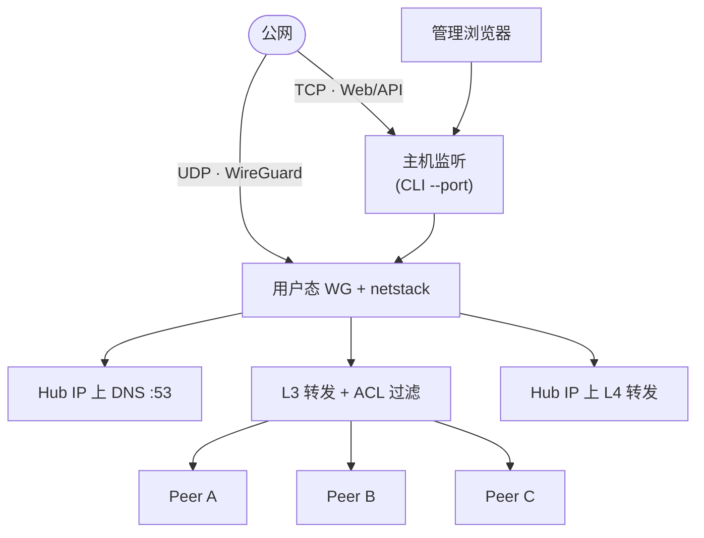

<h1 align="center">WireHub</h1>

<p align="center">
  <strong>集中式星型 WireGuard Hub，内嵌 Web 管理界面。服务端以 <a href="https://github.com/WireGuard/wireguard-go">用户态 WireGuard</a>（gVisor netstack）运行，单点公网 Endpoint，无需内核模块。</strong>
</p>

<p align="center">
  <a href="../README.md">English</a>
</p>

<p align="center">
  <a href="https://go.dev/"></a>
  <a href="https://react.dev/"></a>
  <a href="https://www.docker.com/"></a>
  <a href="../LICENSE"></a>
</p>

<p align="center">
  
</p>

## 功能

- **星型拓扑** — 仅 Hub 需要可路由的公网 Endpoint，各 Peer 主动连出
- **单一二进制** — React 管理界面经 `go:embed` 嵌入；SQLite 持久化
- **初始化向导** — 新建 Hub 或导入 `wirehub.db`；Hub / Admin / Advanced 分区
- **Peer 全生命周期** — 在 Groups 或 Peers 创建；重命名、改组、启停、删除；导出 `.conf` 或二维码
- **内置 DNS** — `hub.wirehub`、`{peer}.wirehub`；`www.*` 别名；其余域名走上游解析
- **组访问控制** — 每 Peer 归属一组；拓扑图上**双向**或**单向**连线（跨组默认拒绝）
- **在线状态** — WebSocket 推送握手、收发流量与用量图表
- **端口转发** — Hub VPN IP 上 TCP/UDP 监听，转发至 FQDN 或 IPv4
- **设置与备份** — 运行参数、改密、数据库导出、密码确认后重置
- **用户态 WireGuard** — [wireguard-go](https://github.com/WireGuard/wireguard-go) + gVisor netstack；Hub 侧无主机 TUN

## 架构



- **控制面** — Gin REST API + React UI（JWT 鉴权）；状态经 WebSocket 推送。
- **数据面** — WireGuard 隧道终结于 netstack。Peer 间流量按组策略转发与过滤；访问 Hub 自身（Web、DNS、转发监听端口）不受 Peer ACL 约束。

## 快速开始

### Docker

```bash
docker pull ghcr.io/touken928/wirehub:latest

docker run -d --name wirehub \
  --restart unless-stopped \
  -p 8443:8443 \
  -p 8443:8443/udp \
  -v wirehub-data:/app/data \
  ghcr.io/touken928/wirehub:latest
```

本地构建：`docker compose -f docker/compose.yml up -d --build`。

无需 `--cap-add` 或 `--privileged`。镜像默认：数据目录 `/app/data`，端口 `8443`，绑定 `0.0.0.0`。

首次配置打开 **http://localhost:8443/setup**。

### 预编译二进制

从 [GitHub Releases](https://github.com/touken928/wirehub/releases) 下载（`wirehub-vX.Y.Z-<平台>`）。支持 Linux amd64/arm64、macOS arm64、Windows amd64。

```bash
chmod +x wirehub-vX.Y.Z-linux-amd64
./wirehub-vX.Y.Z-linux-amd64 --data-dir ./data
```

### 源码构建

需要 Go 1.26+、Node.js 22+。

```bash
cd web && npm ci && npm run build && cd ..
go build -o wirehub ./cmd/wirehub
./wirehub --data-dir ./data
```

前端产物：`internal/static/dist`（`go:embed` 嵌入）。

## 首次配置

全新安装时 HTTP 服务立即启动；WireGuard 与 DNS 在配置完成后才启动。

1. 打开 **http://&lt;主机&gt;:&lt;端口&gt;/setup**
2. **导入**已有 `wirehub.db`，或填写 **新 Hub** 表单（Hub / Admin / Advanced）
3. 使用管理员账号登录

| 字段 | 默认值 | 说明 |
|------|--------|------|
| Public endpoint | — | 客户端 `Endpoint` 中的主机名或 IP（`:` 之前） |
| Client endpoint port | `8443` | 客户端 `Endpoint` 端口；NAT 下可与 CLI `--port` 不同 |
| VPN subnet | `100.127.0.0/24` | Hub 与 DNS 使用首个主机地址（`.1`） |
| Admin username | `admin` | 初始化后不可改 |
| Admin password | — | 必填，至少 8 位 |
| MTU | `1420` | 可在设置中修改；变更会重启 VPN 栈 |
| Status interval | `1` 秒 | Peer 状态轮询间隔 |
| Upstream DNS | —（可选） | 非 `wirehub` 域名的上游解析；留空则仅解析 `*.wirehub` |

JWT 密钥：`{data-dir}/.jwt_secret`（首次启动时生成）。

## 配置项

### 命令行（仅进程级）

| 参数 | 默认 | 作用 |
|------|------|------|
| `--port` | `8443` | 主机 TCP（Web/API）与 UDP（WireGuard）监听端口 |
| `--bind` | `0.0.0.0` | HTTP 绑定地址 |
| `--data-dir` | `./data` | SQLite 与密钥目录 |

数据库中的 `listen_port` 仅写入 Peer 配置，不改变 Hub 绑定端口。

### 数据库（初始化后）

| 项 | UI 可改 | 说明 |
|----|--------|------|
| 公网 Endpoint、网段、管理员用户名、客户端 Endpoint 端口 | 否 | 仅在 setup 或导入 DB 时设定 |
| MTU、状态间隔、上游 DNS | 是 | **Settings** |
| 管理员密码 | 是 | **Settings** |
| 导出 / 重置 | — | 导出完整 `wirehub.db`；重置清空数据（需密码） |

## 管理界面

| 页面 | 功能 |
|------|------|
| **Dashboard** | Hub 概览、Endpoint、Peer 状态与流量图 |
| **Groups** | 拓扑图；连线模式（双向 / 单向）；组内 Peer 卡片；重命名、改组 |
| **Peers** | 全部 Peer，支持搜索与筛选；创建、重命名、改组、下载配置、启停、删除 |
| **Forward** | 在 Hub VPN IP 上 TCP/UDP 监听并转发至目标 |
| **Settings** | 运行参数、改密、导出、重置 |

破坏性操作需确认；重置 Hub 还需输入管理员密码。

## 客户端接入

1. 在 **Groups**（组侧栏）或 **Peers**（对话框选组）创建 Peer
2. 下载 `.conf` 或扫描二维码
3. 导入 WireGuard 客户端并连接

配置含密钥、`Endpoint`、`AllowedIPs`（整段 VPN 网段）、`DNS`（仅 Hub VPN IP）与 MTU。注释中给出隧道内管理地址 `http://hub.wirehub/`（Hub VPN IP 上 80 端口；宿主机绑定端口默认为 `8443`）。

## 网络行为

### DNS

Hub VPN IP 上提供解析（UDP 53）。后缀固定为 `wirehub`，Hub 标签为 `hub`。

| 名称 | 结果 |
|------|------|
| `hub.wirehub`、`www.hub.wirehub` | Hub VPN IP |
| `{peer}.wirehub`、`www.{peer}.wirehub` | 对应 Peer VPN IP |

裸域名 `wirehub` / `www.wirehub` 不解析。配置上游 DNS 后，其余查询由 Hub 服务端转发（不写入 Peer 配置）；未配置时外网域名不解析。其他 VPN/代理（如 Clash TUN）可能劫持 DNS，导致无法解析 `*.wirehub`。

### 访问控制

- 每个 Peer 仅属 **一个组**；同组 Peer 可直接互通。
- **跨组**访问须在 **Groups** 拓扑上显式连线（默认拒绝）。
  - **双向** — 两组均可主动访问对方。
  - **单向**（`A → B`）— `A` 仍按 `B` 的 IP 与端口访问；Hub 对出站 SNAT，使 `B` 只见 Hub；回程改写后 `A` 仍认为来自 `B`。`B` 不能主动访问 `A`。

策略仅作用于 Peer 间流量，不影响访问 Hub Web 或 DNS。

### 端口转发

规则在 **Hub VPN IP** 上监听并转发。Peer 在隧道内访问 `{hub_ip}:{监听端口}`。

| 目标 | 解析 |
|------|------|
| `*.wirehub` FQDN | Hub 权威 DNS |
| 外网域名 | 上游 DNS（A 记录） |
| IPv4 | 字面地址 |

目标须为 FQDN 或 IPv4（不接受无域后缀的 Peer 名）。切换 **Enabled** 即时生效，无需重启 VPN 栈。此为显式 L4 代理，与组间单向 SNAT 无关。

## 开发

```bash
# 后端 + 内嵌 UI
cd web && npm ci && npm run build && cd ..
go run ./cmd/wirehub --data-dir ./data

# 前端热更新（/api 代理到 :8080）
go run ./cmd/wirehub --port 8080 --data-dir ./data   # 终端 1
cd web && npm run dev                                 # 终端 2

go test ./...
```

## 许可证

[GNU General Public License v3.0](../LICENSE)
