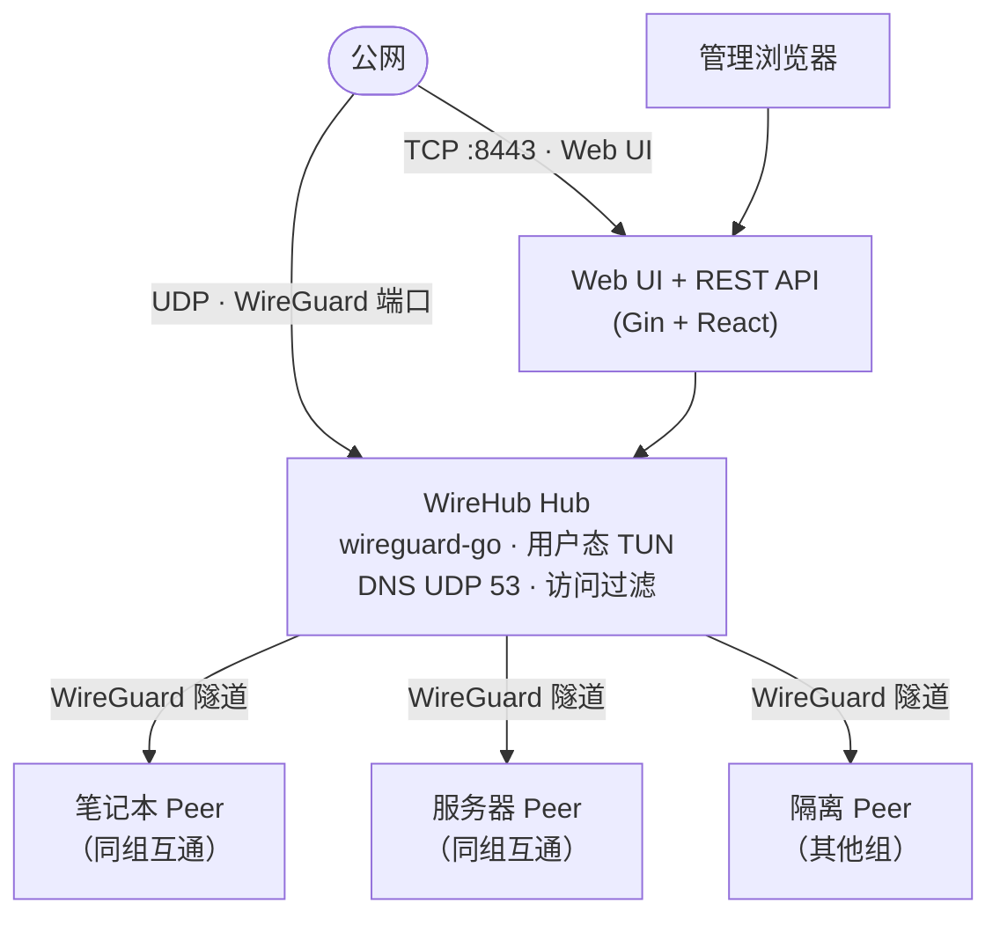

<h1 align="center">WireHub</h1>

<p align="center">
  <strong>集中式 Hub-and-Spoke WireGuard 管理平台 — 一台公网 Hub、内置 Web 控制台，Hub 侧使用 <a href="https://github.com/WireGuard/wireguard-go">用户态 WireGuard</a>（wireguard-go + gVisor netstack），无需内核模块。</strong>
</p>

<p align="center">
  <a href="../README.md">English</a>
</p>

<p align="center">
  <a href="https://go.dev/"></a>
  <a href="https://react.dev/"></a>
  <a href="https://www.docker.com/"></a>
  <a href="../LICENSE"></a>
</p>

<p align="center">
  
</p>

## 功能

- **星型拓扑** — 仅 Hub 需要可路由的公网 Endpoint，各 Peer 主动连出
- **Web 管理界面** — React + Fluent UI，发布版内嵌于单一二进制
- **Peer 全生命周期** — 创建、编辑、禁用、删除；导出 `.conf` 或扫码导入
- **内置 DNS** — `{name}.wirehub`；`www.{name}.wirehub` 为别名（`www` 指向 Hub）
- **组访问控制** — 每个用户归属一个组；组间互通由管理员在 UI 中配置（默认拒绝）
- **在线状态** — 最近握手时间、收发流量、用量图表
- **设置与备份** — 修改 Hub 运行参数、导出/导入完整 `wirehub.db`、密码确认的 Reset
- **用户态 WireGuard** — [wireguard-go](https://github.com/WireGuard/wireguard-go) + gVisor netstack，Hub 侧无需内核模块

## 工作原理



完成初始化后，Hub 在 VPN 地址上提供 **TCP（经隧道的 Web UI）** 与 **UDP 53（DNS）**。**WireGuard UDP 端口** 保存在数据库中，并写入客户端配置（`Endpoint = <公网地址>:<端口>`），与 **Web UI 端口**（`--port`，默认 `8443`）相互独立。

Peer 间流量由 Hub 做 L3 转发并按组规则过滤；访问 Hub 自身（Web、DNS）不受 Peer 过滤影响。

## Web 界面

| 页面 | 说明 |
|------|------|
| **Dashboard** | Hub 状态、WireGuard Endpoint、实时流量图 |
| **Groups** | React Flow 拓扑 — 组间拖线表示允许互通；点击组管理成员 |
| **Users** | 全部 Peer 及在线状态、配置下载、启用/禁用、删除 |
| **Settings** | 可改 Hub 参数、修改密码、导出数据库、危险区 Reset |

删除用户/组、断开组间连线、Reset Hub 等破坏性操作需在界面中确认；Reset 还需输入管理员密码。

## 环境要求

| 组件 | 版本 |
|------|------|
| Go（源码构建） | 1.26+ |
| Node.js（前端构建） | 22+ |
| Docker（可选） | 20+ |

## 快速开始

### Docker（推荐）

从 GitHub Container Registry 拉取发布镜像：

```bash
docker pull ghcr.io/touken928/wirehub:latest

docker run -d --name wirehub \
  -p 8443:8443 \
  -p 8443:8443/udp \
  -v wirehub-data:/app/data \
  ghcr.io/touken928/wirehub:latest
```

若在配置向导中把 **WireGuard 端口** 设为非 `8443`（例如 `51820`），需额外映射对应 UDP 端口：

```bash
  -p 8443:8443 \
  -p 51820:51820/udp \
```

本地用 Compose 构建：

```bash
docker compose -f docker/docker-compose.yml up -d --build
```

浏览器打开 **http://localhost:8443/setup**，完成首次配置向导。

无需 `--cap-add` 或 `--privileged`：WireHub 使用 wireguard-go 的用户态 netstack（gVisor），不依赖内核 TUN 设备。镜像内 CLI 参数（`--data-dir`、`--port`、`--bind`）可省略，默认分别为 `./data`（`WORKDIR /app` 下即 `/app/data`）、`8443`、`0.0.0.0`。

### 预编译二进制

在 [GitHub Releases](https://github.com/touken928/wirehub/releases) 下载对应平台的可执行文件（未压缩），例如：

```bash
chmod +x wirehub-vX.Y.Z-linux-amd64
./wirehub-vX.Y.Z-linux-amd64 --data-dir ./data
```

```powershell
.\wirehub-vX.Y.Z-windows-amd64.exe --data-dir .\data
```

发布目标：**Linux amd64**、**Linux arm64**、**macOS arm64**、**Windows amd64**。

### 从源码构建

```bash
cd web && npm ci && npm run build && cd ..
go build -o wirehub ./cmd/wirehub
./wirehub --data-dir ./data
```

前端产物输出到 `internal/static/dist`，由 `internal/static/static.go` 通过 `go:embed` 嵌入二进制。

## 首次配置

全新安装时 HTTP 服务会立即启动，WireGuard 与 DNS 仅在完成配置后才会启动。

1. 打开 **http://&lt;主机&gt;:8443/setup**（或你的 `--port`）
2. 可先 **导入 wirehub.db** 恢复备份，**或** 填写下方新 Hub 表单
3. 使用创建的管理员账号登录

### 新 Hub 向导

| 字段 | 必填 | 说明 |
|------|------|------|
| Public endpoint | 是 | 客户端 `Endpoint` 中的主机名或 IP（端口前），如 `example.com` |
| WireGuard port | 是 | 客户端配置中的 UDP 端口（`Endpoint = 主机:端口`）；提示默认 **8443**，不预填 |
| VPN subnet | 否 | 默认 `100.127.0.0/24`；Hub 与 DNS 使用首个主机地址（`.1`） |
| 管理员用户名 | 否 | 默认 `admin` |
| 管理员密码 | 是 | 至少 8 位；SQLite 中以 bcrypt 存储 |
| MTU | 否 | 默认 `1420` |
| 状态轮询间隔 | 否 | 默认 `1` 秒 |
| 额外 DNS | 否 | 默认 `1.2.4.8`、`1.1.1.1`，写入客户端配置并由 Hub 转发外网查询 |

### 导入

上传此前导出的 **wirehub.db** 可恢复组、用户与 Hub 设置，随后用原管理员账号登录。

JWT 签名密钥在首次启动时自动生成，保存在 `{data-dir}/.jwt_secret`。

## 设置（初始化之后）

在侧栏打开 **Settings**。

| 区域 | 是否可改 |
|------|----------|
| Hub（只读） | 公网 Endpoint、VPN 网段、管理员用户名 |
| 可编辑 | WireGuard 端口、MTU、状态轮询间隔、额外 DNS |
| 修改密码 | 当前密码 + 新密码 |
| 导出 | 下载完整 `wirehub.db` 快照 |
| 危险区 | **Reset WireHub** — 清空全部数据；需输入管理员密码 |

修改 **WireGuard 端口** 或 **MTU** 会重启 Hub 网络栈。**Reset** 后回到配置向导。

初始化后不可在 UI 修改的项：公网 Endpoint、VPN 网段、管理员用户名（仅在向导或导入数据库时确定）。

## 命令行参数

仅影响进程运行，不写入数据库：

| 参数 | 默认值 | 说明 |
|------|--------|------|
| `--port` | `8443` | **Web UI 与 REST API** 的 TCP 端口 |
| `--bind` | `0.0.0.0` | HTTP 监听地址 |
| `--data-dir` | `./data` | SQLite、JWT 密钥及持久化数据目录 |

```bash
./wirehub --port 8443 --bind 0.0.0.0 --data-dir ./data
```

**WireGuard 监听端口** 在配置向导与 **Settings** 中设置，**不能** 通过 `--port` 指定。

## 客户端接入

1. 登录 Web 控制台
2. 在 **Groups** 中选择组并添加用户，或在 **Users** 中管理 Peer
3. 下载 `.conf` 或扫描二维码
4. 导入任意 WireGuard 客户端并连接

生成的配置包含 `Endpoint = <公网 Endpoint>:<WireGuard 端口>`、密钥、AllowedIPs、DNS（Hub IP + 额外解析器）及 MTU。

## DNS

WireHub 在 Hub VPN IP 上提供 DNS 服务（UDP 53）。`wirehub` 下的名称由 Hub 权威解析；其他查询会转发到配置时设置的**额外 DNS**（默认 `1.2.4.8`、`1.1.1.1`）。

客户端 WireGuard 配置中的 DNS 为 `{hub_ip}, {upstream…}`，Peer 经 Hub 解析内网主机名，并通过上游解析器访问公网。

| 域名 | 解析结果 |
|------|----------|
| `wirehub` | Hub VPN IP |
| `www.wirehub` | Hub VPN IP（别名） |
| `{peer}.wirehub` | 对应 Peer VPN IP |
| `www.{peer}.wirehub` | 对应 Peer VPN IP（别名） |

域名后缀固定为 `wirehub`（见 `internal/config/config.go`）。

## 访问控制

每个用户只能属于 **一个组**。同组用户默认可互相访问。**组间访问** 在 **Groups** 页面（React Flow）中配置：组之间连线表示允许互通；未连线的组 **默认不可访问**。

规则在 Hub 用户态转发路径中执行，仅作用于 **Peer ↔ Peer** 流量，不影响访问 Hub Web 或 DNS。

## 开发

**后端 + 内嵌 UI**（接近生产环境）：

```bash
cd web && npm ci && npm run build && cd ..
go run ./cmd/wirehub --data-dir ./data
```

**前端热更新**（API 代理，Go 服务需监听 `8080`）：

```bash
# 终端 1
go run ./cmd/wirehub --port 8080 --data-dir ./data

# 终端 2
cd web && npm ci && npm run dev
```

Vite 将 `/api` 代理到 `http://localhost:8080`（见 `web/vite.config.ts`）。

**测试：**

```bash
go test ./...
```

## 许可证

[GNU General Public License v3.0](../LICENSE)
